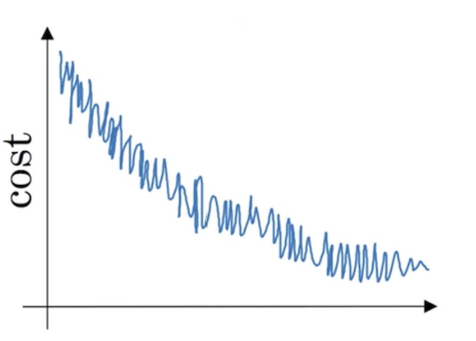
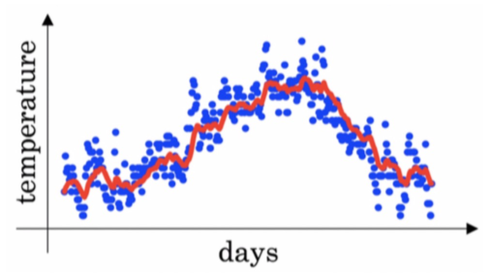
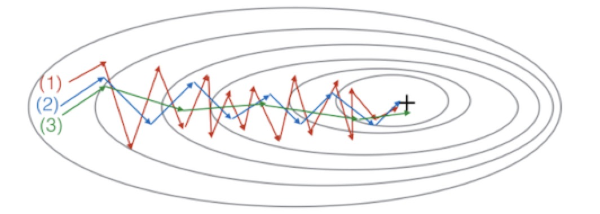

<h1 align="center">C2W2 优化算法</h1>

## 测验
___
> 1、当输入从第八个mini-batch的第七个的例子的时候，你会用哪种符号表示第三层的激活？

    注：[i]{j}(k)为上标，分布表示第i层，第j小块，第k个示例。
- [ ] a[8]{3}(7)
- [ ] a[8]{7}(3)
- [x] a[3]{8}(7)
- [ ] a[3]{7}(8)
___
> 2、下面关于小批量(mini-batch)梯度下降法的说法，哪个是正确的？
- [x] 使用小批量(mini-batch)梯度下降训练一次迭代（在单个小批量上计算）比使用批量梯度下降训练一个epoch更快。
- [ ] 实现小批量(mini-batch)梯度下降时，不需要在不同的小批量上使用显式for循环，这样算法才能同时处理所有的小批量(矢量化方法)。
- [ ] 使用小批量(mini-batch)梯度下降训练一个epoch（训练集中的全部样本训练一次）比使用批量梯度下降训练一个epoch更快。
___
> 3、为什么最好的mini-batch的大小通常不是1也不是m，而是介于两者之间？
- [ ] 如果mini-batch大小为m，那么会出现随机梯度下降，这通常比小批量梯度下降慢。
- [x] 如果mini-batch大小为m，那么会出现批量梯度下降，这需要在进行训练之前对整个训练集进行处理。
- [x] 如果mini-batch大小为1，则会失去mini-batch中矢量化带来的的好处。
- [ ] 如果mini-batch大小为1，那么需要在进行训练之前对整个训练集进行处理。
___
> 4、如果你的模型的成本J随着迭代次数的增加，绘制出来的图如下，那么：

- [ ] 无论你使用的是批量梯度下降法还是小批量梯度下降法，模型都有问题。
- [ ] 无论你使用的是批量梯度下降法还是小批量梯度下降法，这看起来都是可以接受的。
- [ ] 如果你使用的是小批量梯度下降法，那么模型就有问题。但是如果你使用的是批量梯度下降法，这看起来是可以接受的。
- [x] 如果你使用的是小批量梯度下降法，这看起来是可以接受的。但是如果你使用的是批量梯度下降法，那么模型就有问题。
___
> 5、假设一月的前三天卡萨布兰卡的气温是一样的：
 
> 一月的第一天: θ{1} = 10

> 一月的第二天: θ{2}*10

> 假设您使用β= 0.5的指数加权平均来跟踪温度：v{0} = 0，v{t} = β*v{t−1} + (1-β) * θ{t}。 如果v{2}是在没有偏差修正的情况下计算第2天后的值，并且v(corrected){2}是你使用偏差修正计算的值。 这些下面的值是正确的是？

    注：(corrected)为上标，{1}、{2}、{t}、{t−1}为下标
- [x] v{2} = 7.5, v(corrected){2} = 10
- [ ] v{2} = 10, v(corrected){2} = 7.5
- [ ] v{2} = 7.5, v(corrected){2} = 7.5
- [ ] v{2} = 10, v(corrected){2} = 10
___
> 6、下面哪一个不是比较好的学习率衰减方法？
- [ ] α = α_0 / (1+2*t)
- [x] α = e^t * α_0
- [ ] α = 0.95^t * α_0
- [ ] α = α_0 / √t
___
> 7、您在伦敦温度数据集上使用指数加权平均值， 您可以使用以下公式来追踪温度：v{t} = βv{t-1} +（1 - β）θ{t}。 下面的红线使用的是β= 0.9来计算的。 当你改变β时，你的红色曲线会怎样变化？ 

- [ ] 减小β会使红线稍微向右移动
- [x] 增加β会使红线稍微向右移动
    ```diff
    红线对应β=0.9。吴恩达视频中，有一条β=0.98的绿线，线条稍微向右移动。
    ```    
- [x] 减少β会在红线内产生更多的振荡
    ```diff
    红线对应β=0.9。吴恩达视频中，有一条β=0.5的黄线，线条有很多振荡。
    ```
- [ ] 增加β会在红线内产生更多的振荡
___

> 8、如图

> 这些线条是由梯度下降产生的; 具有动量梯度下降（β= 0.5）和动量梯度下降（β= 0.9）。 哪条曲线对应哪种算法？
- [ ] （1）是动量梯度下降（β比较小）。（2）是梯度下降。（3）是动量梯度下降（β值比较大）。
- [x] （1）是梯度下降。（2）是动量梯度下降（β值比较小）。（3）是动量梯度下降（β比较大）。
- [ ] （1）是梯度下降。（2）是动量梯度下降（β值比较大）。（3）是动量梯度下降（β比较小）。
- [ ] （1）是动量梯度下降（β比较小）。（2）是动量梯度下降（β比较小）。（3）是梯度下降。
___
> 9、假设在一个深度学习网络中批处理梯度下降花费了太多的时间来找到一个值的参数值，该值对于成本函数J(W[1],b[1],…,W[L],b[L])来说是很小的值。 以下哪些方法可以帮助找到J值较小的参数值？
- [x] 尝试调整学习率α
- [ ] 尝试把权值初始化为0
- [x] 尝试对权重进行更好的随机初始化
- [x] 尝试使用mini-batch梯度下降法
- [x] 尝试使用Adam算法
___
> 10、关于Adam算法，下列哪一个陈述是错误的？
- [ ] Adam结合了RMSProp和Momentum的优势
- [x] Adam应该用于批量梯度计算，而不是用于mini-batch
- [ ] Adam中的学习速率超参数α通常需要调整。
- [ ] Adam中，超参数β1、β2和ε通常使用“默认”值（β1=0.9，β2=0.999，ε=10−8）
___