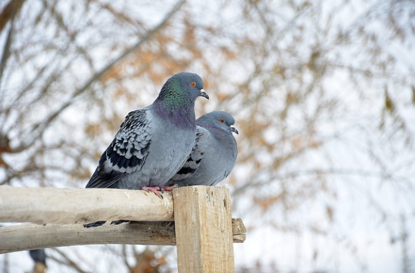

<h1 align="center">C3W1 和平之城中的鸟类识别(案例研究)</h1>

## 测验

>  ## 1.问题陈述

> 这个例子是根据实际的生产应用改编而来，但是为了保护机密性，对细节进行了伪装。

> 现在你是和平之城的著名研究员，和平之城的人有一个共同的特点：他们害怕鸟类。为了保护他们，你必须设计一个算法，来检测`飞越和平之城的任何鸟类`，同时警告人们有鸟类飞过。

> 地方议会为你提供了10,000,000张图片的数据集，这些都是从城市的安全摄像头拍摄到的。图片的标注为:
> * y = 0: 图片中没有鸟类
> * y = 1: 图片中有鸟类

> 你的目标是设计一个算法，能够对和平之城安全摄像头拍摄的新图像进行分类。

> 有很多决定要做：
> * 评估指标是什么？
> * 你如何将你的数据分割为训练/验证/测试集?

>  ## 成功的指标
> 地方议会告诉你，他们想要一个算法：

> 1. 拥有较高的准确度
> 2. 快速运行，只需要很短的时间来分类一个新的图像。
> 3. 可以适应小内存的设备，这样它就可以运行在一个小的处理器上，它将用于城市的安全摄像头上。

>  `注意`: 有三个评估指标使你很难在两种不同的算法之间进行快速选择，并且会减慢你团队开发迭代的速度。对/错？
- [x] 正确
- [ ] 错误
___
> 2、经过进一步讨论，地方议会缩小了它的标准：

> * “我们需要一种算法，可以让我们尽可能精确地知道一只鸟正在飞过和平之城。”
> * “我们希望经过训练的模型用不超过10s的时间对新图像进行分类”
> * “我们希望这个模型能适应于10MB内存的设备。”

> 如果你有以下三个模型，你会选择哪一个？
- [ ] A.

    |测试准确度|运行时间|内存大小| 
    |:------------:|:------------:|:------------:|
    |97%|1 sec|3MB| 
- [ ] B.

    |测试准确度|运行时间|内存大小| 
    |:------------:|:------------:|:------------:|
    |99%|13 sec|9MB| 
- [ ] C.

    |测试准确度|运行时间|内存大小| 
    |:------------:|:------------:|:------------:|
    |97%|3 sec|2MB| 
- [x] D.

    |测试准确度|运行时间|内存大小| 
    |:------------:|:------------:|:------------:|
    |98%|9 sec|9MB| 

     ```diff
    只要运行时间少于10秒，就很好了。因此，在确保运行时间小于10秒后，只需要尽可能地使测试准确度最高。
     ```
___
> 3、根据城市的要求，你认为以下哪一项是正确的？
- [x] 准确度是优化指标; 运行时间和内存大小是满足指标。
- [ ] 准确度是满足指标; 运行时间和内存大小是优化指标。
- [ ] 准确性、运行时间和内存大小都是优化指标，因为你希望在所有这三方面都做得很好。
- [ ] 准确性、运行时间和内存大小都是满足指标，因为你必须在三项方面做得足够好才能使系统被接受。
___
> ## 4、结构化你的数据
> 在实现你的算法之前，你需要将你的数据分割成训练/验证/测试集，你认为哪一个是最好的选择？

- [ ] A.

    |训练集|验证集|测试集| 
    |:------------:|:------------:|:------------:|
    |6,000,000|1,000,000|3,000,000| 
    
- [ ] B.

    |训练集|验证集|测试集| 
    |:------------:|:------------:|:------------:|
    |6,000,000|3,000,000|1,000,000| 
    
- [x] C.

    |训练集|验证集|测试集| 
    |:------------:|:------------:|:------------:|
    |9,500,000|250,000|250,000| 
        
- [ ] D.

    |训练集|验证集|测试集| 
    |:------------:|:------------:|:------------:|
    |3,333,334|3,333,333|3,333,333| 


___
> 5、在设置了训练/验证/测试集之后，地方议会再次给你了1,000,000张图片，称为“公民数据”。 显然，和平之城的公民非常害怕鸟类，他们自愿为天空拍照并贴上标签，从而为这些额外的1,000,000张图像贡献力量。 这些图像与地方议会最初给你的图像分布不同，但你认为它对你的算法有帮助。

> 你不应该将公民数据添加到训练集中，因为这会导致训练/验证/测试集分布变得不同，从而负面影响模型在验证集和测试集性能表现。对/错？
- [ ] 正确
- [x] 错误

    ```diff
    将此数据添加到训练集将改变训练集的分布。然而，训练集和验证集的分布不同并不是问题。
    相反，验证集和测试集的分布不同，将造成非常多的问题。
    ```
___
> 6、地方议会的一名成员对机器学习知之甚少，他认为应该将1,000,000个公民的数据图像添加到测试集中，你反对的原因是：
- [x] 测试集不再反映你最关心的数据(安全摄像头拍摄的图片)的分布。
- [ ] 1,000,000张公民的数据图像与其他数据没有一致的x- >y映射(类似于纽约/底特律的住房价格例子)。
- [ ] 一个更大的测试集将减慢开发迭代速度，因为测试集上评估模型会有计算开销。
- [x] 这会导致验证集和测试集分布变得不同。这是一个很糟糕的主意，将达不到想要的效果。
___
> 7、你训练了一个系统，其误差度如下（误差度 = 100％ - 准确度）：

|训练集误差|4.0%|
|:------------:|:------------:|
|__验证集误差__|__4.5%__|

>  这表明，提高性能的一个很好的途径是训练一个更大的网络，以降低4%的训练误差。你同意吗？

- [ ] 是的，因为有4%的训练误差表明你有很高的偏差。
- [ ] 是的，因为这表明你的模型的偏差高于方差。
- [ ] 不同意，因为方差高于偏差。
- [x] 不同意，因为没有足够的信息，这什么也说明不了。
___

> 8、你让一些人对数据集进行标记，以便找出人们对它的识别度。你发现准确度如下：

|鸟类专家1|错误率：0.3%|
|:------------:|:------------:|
|__鸟类专家2__|__错误率：0.5%__|
|__普通人1 (非专家)__|__错误率：1.0%__|
|__普通人2 (非专家)__|__错误率：1.2%__|

> 如果你的目标是将“人类表现”作为贝叶斯错误的基准线（或估计），那么你如何定义“人类表现”？
- [ ] 0.0% (因为不可能做得比这更好)
- [x] 0.3% (专家1的错误率)
- [ ] 0.4% (0.3 到 0.5 之间)
- [ ] 0.75% (以上所有四个数字的平均值)
___
> 9、你同意以下哪项陈述？
- [x] 学习算法的性能可以优于人类表现，但它永远不会优于贝叶斯错误的基准线。
- [ ] 学习算法的性能不可能优于人类表现，但它可以优于贝叶斯错误的基准线。
- [ ] 学习算法的性能不可能优于人类表现，也不可能优于贝叶斯错误的基准线。
- [ ] 学习算法的性能可以优于人类表现，也可以优于贝叶斯错误的基准线。
___
> 10、你发现一个由鸟类专家组成的团队在辩论和讨论每张图像后，得到了更好的0.1%的表现，所以你将其定义为“人类表现”。在对算法进行深入研究之后，最终得出以下结论：

|人类表现|0.1%|
|:------------:|:------------:|
|__训练集误差__|__2.0%__|
|__验证集误差__|__2.1%__|

> 根据你的资料，以下四个选项中哪两个尝试起来是最有希望的？（两个选项。）
- [x] 训练一个更大的模型，试图在训练集上做得更好。
- [x] 尝试减少正则化。
- [ ] 尝试增加正则化。
- [ ] 获得更大的训练集以减少差异。
___
> 11、你在测试集上评估你的模型，并得到以下内容：

|人类表现|0.1%|
|:------------:|:------------:|
|__训练集误差__|__2.0%__|
|__验证集误差__|__2.1%__|
|__测试集误差__|__7.0%__|

> 这意味着什么？（两个最佳选项。）
- [x] 你对验证集过拟合了。
- [x] 你需要尝试获得更大的验证集。
- [ ] 你没有拟合验证集
- [ ] 你需要更大的测试集。
___
> 12、在一年后，你完成了这个项目，你终于实现了：

|人类表现|0.1%|
|:------------:|:------------:|
|__训练集误差__|__0.05%__|
|__验证集误差__|__0.05%__|

> 你能得出什么结论？ （检查所有选项。）
- [x] 如果测试集足够大，保证这0.05%的误差估计是准确的，这意味着贝叶斯误差是小于等于0.05的。
- [ ] 只有0.09％的进步空间，你应该很快就能够将剩余的差距缩小到0％
- [ ] 这是统计异常(或者是统计噪声的结果)，因为它不可能超过人类表现。
- [x] 现在很难衡量可避免的偏差，因此今后的进展将会放缓。
___
> 13、事实证明，和平之城也雇佣了你的竞争对手来设计一个系统。你的系统和竞争对手都被提供了相同的运行时间和内存大小的系统，但你的系统有更高的准确性。然而，当你和你的竞争对手的系统进行测试时，和平之城实际上更喜欢竞争对手的系统，因为即使你的整体准确率更高，你也会有更多的假阴性结果(当鸟在空中时没有发出警报)。你该怎么办？

- [ ] 查看开发过程中开发的所有模型，找出假阴性错误率最低的模型。
- [ ] 要求你的团队在开发过程中同时考虑准确性和假阴率。
- [x] 重新思考此任务合适的指标，并要求你的团队调整到新指标。
- [ ] 选择假阴率作为新指标，并以这个新指标来驱动所有进一步的开发。
___
> 14、你轻易击败了你的竞争对手，你的系统现在被部署在和平之城中，并且保护公民免受鸟类攻击！ 但在过去几个月中，一种新的鸟类已经慢慢迁移到该地区，因此你系统的性能会逐渐下降，因为你的系统正在测试一种新类型的数据。

>  你只有1000张新鸟类的图像，地方政府希望在未来3个月内你能有一个更好的系统。你应该先做什么？
- [x] 你必须定义一个新的评估指标（使用新的验证/测试集）在 加了新物种的数据集上，并使用它来驱动你的团队进一步发展。
- [ ] 把1000张图片放进训练集，以便让系统更好地对这些鸟类进行训练。
- [ ] 尝试数据增强/数据合成，以获得更多新型鸟类的图像。
- [ ] 将1,000幅图像添加到你的数据集中，并重新组合成一个新的训练/验证/测试集。
___
> 15、地方议会认为在城市里养更多的猫会有助于吓跑鸟类，他们对你在鸟类探测器上的工作感到非常满意，他们也雇佣你来设计一个猫探测器。（WoW~猫检测器是非常有用的，不是吗？）由于有多年猫检测器的工作经验，你有一个巨大的数据集，你有100,000,000猫的图像，训练这个数据需要大约两个星期。

> 你同意下面哪些说法？（检查所有选项。）
- [ ] 建立了一个效果比较好的鸟类检测器后，你应该能够采用相同的模型和超参数，并将其应用于猫数据集，因此无需迭代。
- [x] 如果100,000,000个样本足以建立一个足够好的猫检测器，那么你最好只用10,000,00个样本训练，以便在运行实验的速度上获得≈10倍的加速。即使每个模型的性能稍差一点，因为所用的数据较少。
- [x] 需要两周的时间来训练将会限制你开发迭代的速度。
- [x] 购买更快的计算机可以加快团队的开发迭代速度，从而提高团队的生产力。
___